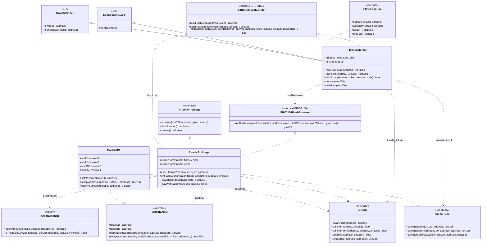
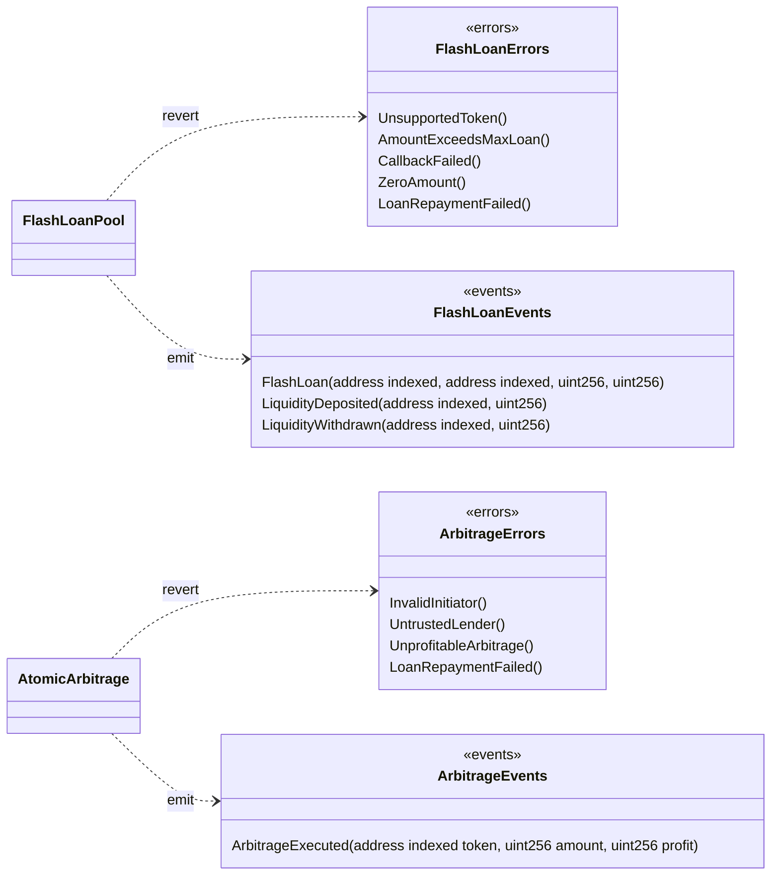
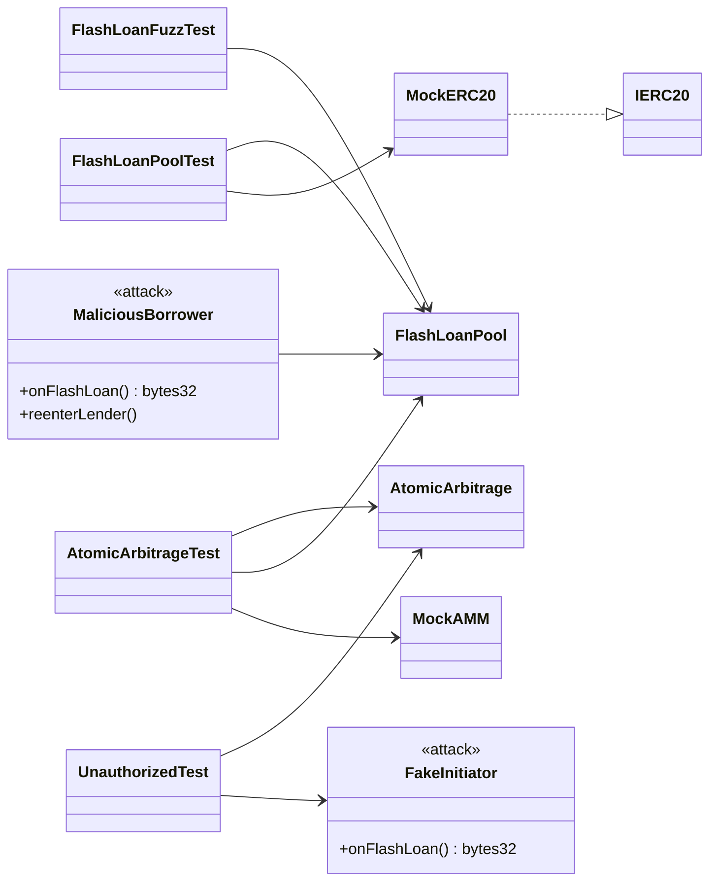
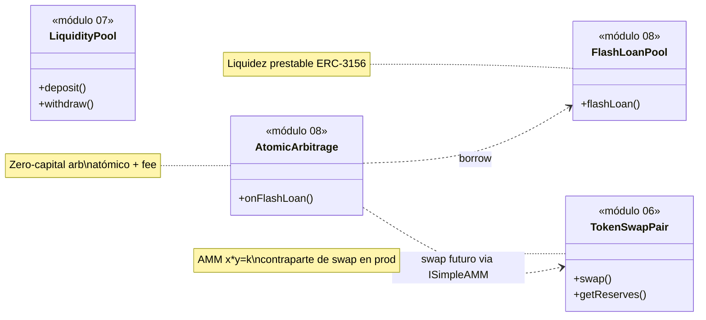

# Diagrama de clases — Flash Loans & Atomic Arbitrage

Modelo estructural **to-be** (módulo 08). Contratos, interfaces ERC-3156, mocks y tests.

## 1. Diagrama principal (UML / Mermaid)



## 2. Errores y eventos



## 3. Tests y actores



## 4. Responsabilidades

| Artefacto | Rol |
|-----------|-----|
| `FlashLoanPool` | Custodia liquidez, presta ERC-20, cobra fee, lock anti-reentrada |
| `AtomicArbitrage` | Inicia el préstamo, autentica callback, swaps, repay, profit a owner |
| `ArbitrageMath` | `repayAmount` e `isProfitable` sin estado |
| `ISimpleAMM` / `MockAMM` | Par token0/token1 con reservas seteables para imbalance |
| `ReentrancyGuard` | Impide reentrar `flashLoan` durante el callback |
| `Ownable2Step` | Admin de liquidez del pool (deposit/withdraw v1) |
| `SafeERC20` | Transfers y allowance del token prestado |
| `MaliciousBorrower` | Intenta reentrar o no devolver el préstamo |

## 5. Dependencias (resumen)

```
FlashLoanPool
  ├── hereda     → ReentrancyGuard, Ownable2Step
  ├── implementa → IERC3156FlashLender, IFlashLoanPool
  ├── usa        → SafeERC20
  ├── llama      → IERC3156FlashBorrower.onFlashLoan
  ├── emite      → FlashLoan / LiquidityDeposited / LiquidityWithdrawn
  └── revierte   → UnsupportedToken / AmountExceedsMaxLoan / CallbackFailed /
                    ZeroAmount / LoanRepaymentFailed

AtomicArbitrage
  ├── implementa → IERC3156FlashBorrower, IAtomicArbitrage
  ├── immutables → flashLender, owner
  ├── usa        → ArbitrageMath, SafeERC20, ISimpleAMM (×2)
  ├── llama      → IERC3156FlashLender.flashLoan
  ├── emite      → ArbitrageExecuted
  └── revierte   → InvalidInitiator / UntrustedLender /
                    UnprofitableArbitrage / LoanRepaymentFailed

MockAMM
  ├── implementa → ISimpleAMM
  └── setReserves → crea spread artificial entre AMM A y AMM B
```

## 6. Layout Solidity

### FlashLoanPool

1. Imports / interfaces / libraries  
2. Contract `FlashLoanPool`  
3. Immutables (`token`) + state (`feeBps`)  
4. Events → Errors → Modifiers (`nonReentrant` heredado)  
5. External: `maxFlashLoan`, `flashFee`, `flashLoan`, `deposit`, `withdraw`  
6. Internal: `_chargeRepayment`

### AtomicArbitrage

1. Imports  
2. Immutables (`flashLender`, `owner`) — **sin** mapping de profits  
3. Events → Errors  
4. External: `execute`, `onFlashLoan`  
5. Internal: `_swapRoundTrip`, `_payProfit` (solo `safeTransfer` a owner)

## 7. Relación con módulos 06 y 07



En v1 los tests usan `MockAMM`. Una integración posterior puede adaptar `ISimpleAMM` a `TokenSwapPair` del módulo 06. El módulo 07 no es requerido para el flash loan.
