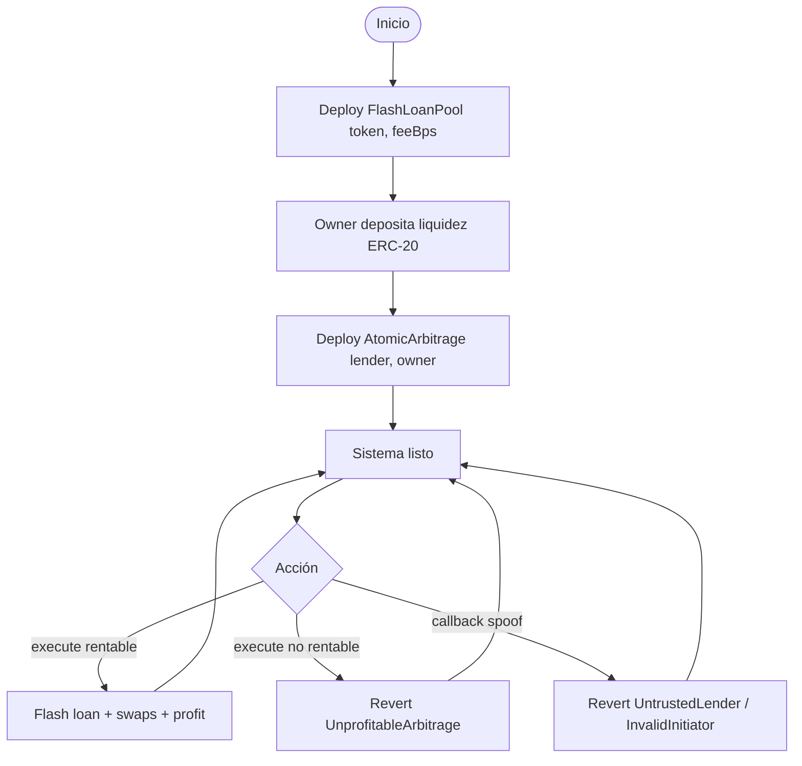
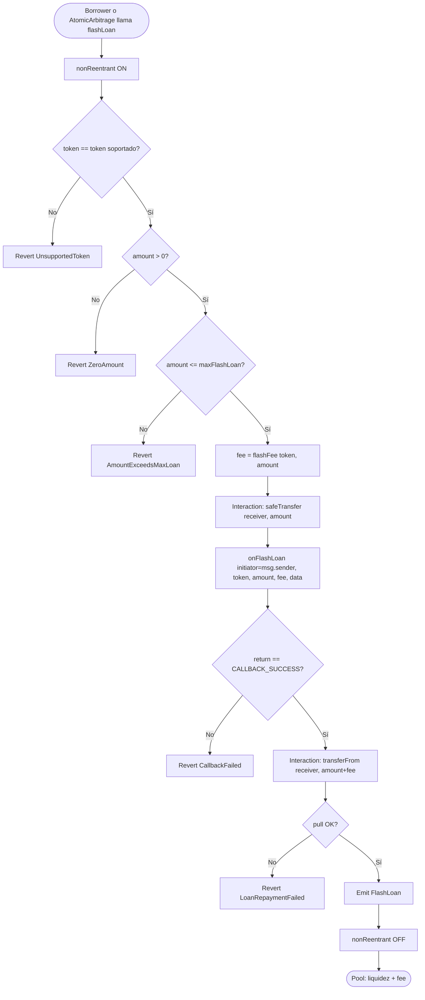
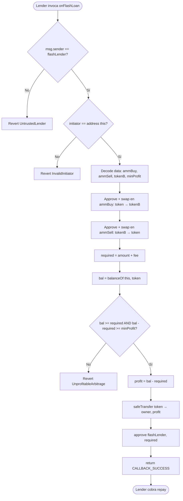
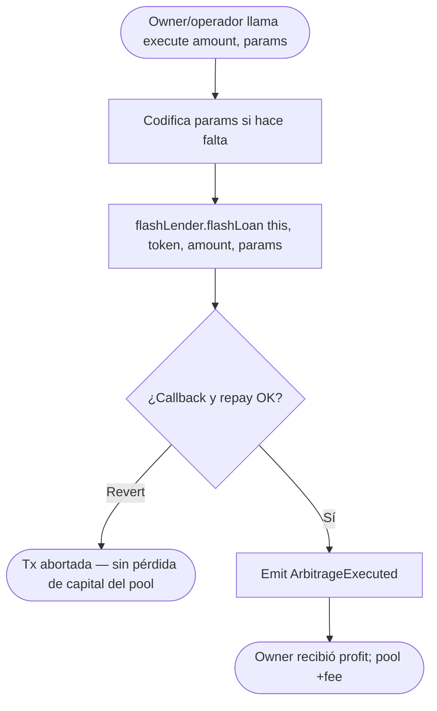
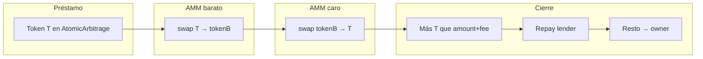
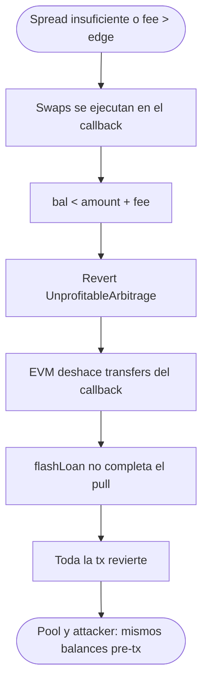
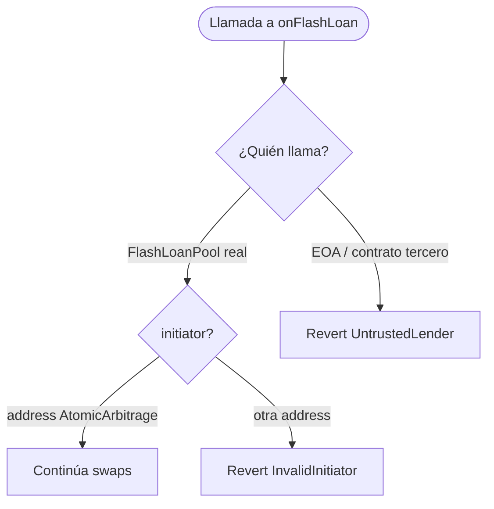
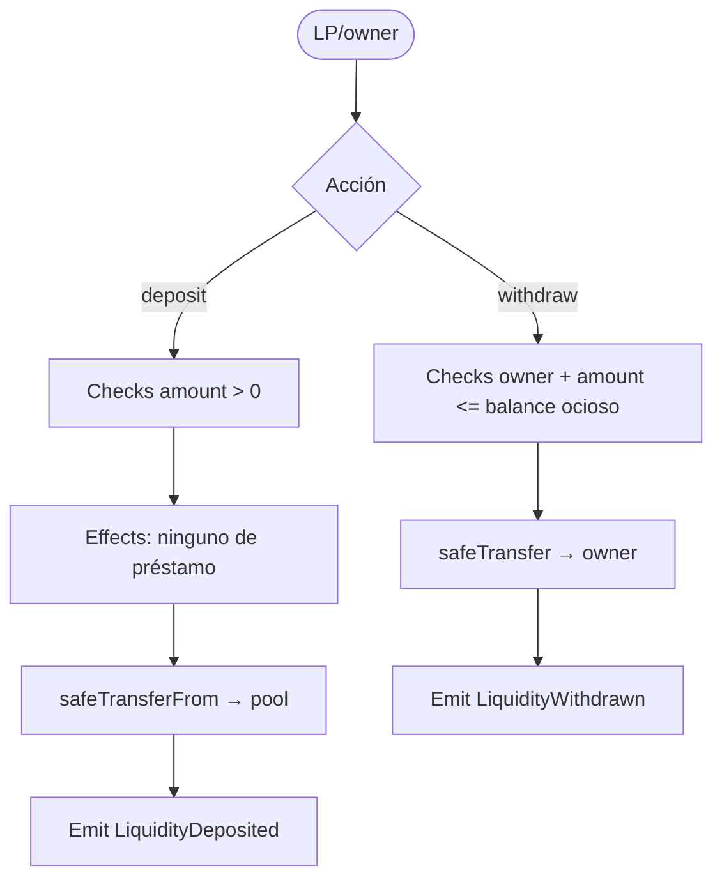

# Diagrama de flujo — Flash Loans & Atomic Arbitrage

Flujos de negocio **to-be** (v1). Ver también [flujograma.md](./flujograma.md) y [PLANIFICACION.md](./PLANIFICACION.md).

## 1. Ciclo de vida del sistema

## 2. Flujo ERC-3156 `flashLoan` (lender)

## 3. Flujo `onFlashLoan` (AtomicArbitrage)

## 4. Flujo de execute (entrada del operador)

`execute` no guarda el profit: el callback transfiere al `owner` immutable.

## 5. Flujo de swaps (round-trip entre dos AMMs)

Dirección del trade (ejemplo): el token prestado se vende donde está **sobrevalorado** y se recompra (vía intermediario) donde está **infravalorado**, o el camino inverso según qué reserva esté desbalanceada. Los params en `data` fijan `ammBuy` / `ammSell`.

## 6. Flujo unprofitable (garantía atómica)

No hay “préstamo a medias”: o se reembolsa con prima o no hubo préstamo efectivo.

## 7. Flujo de autenticación (callers no autorizados)

Un contrato no puede pedirle al pool un flash loan “en nombre” de `AtomicArbitrage` y esperar que el callback acredite a un initiator distinto: `initiator` es `msg.sender` del `flashLoan`, y debe ser `address(this)`.

## 8. Flujo de liquidez del pool (deposit / withdraw)

`maxFlashLoan` = balance actual del token en el pool (v1: no hay loans anidados).

## Leyenda

| Símbolo | Significado |
|---------|-------------|
| Rectángulo | Proceso / acción on-chain |
| Diamante | Decisión / validación |
| Óvalo | Inicio / fin |

## Orden CEI

| Paso | `flashLoan` (pool) | `onFlashLoan` (arb) |
|------|--------------------|---------------------|
| **Checks** | token, amount, maxLoan | lender, initiator |
| **Effects** | lock reentrancy | (sin SSTORE de profit) |
| **Interactions** | transfer out → callback → transferFrom repay | swaps AMM → transfer profit → approve |
| **Checks finales** | magic value + pull OK | `bal >= required` |
