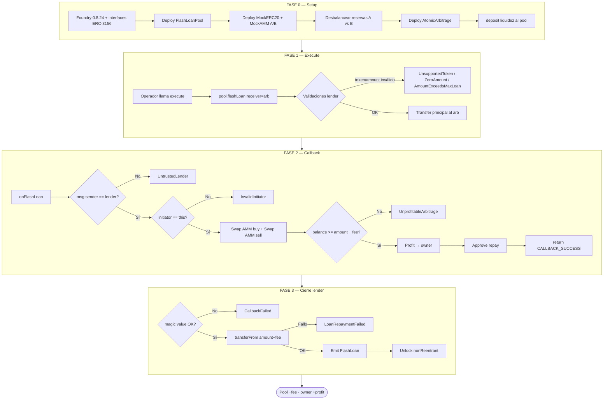
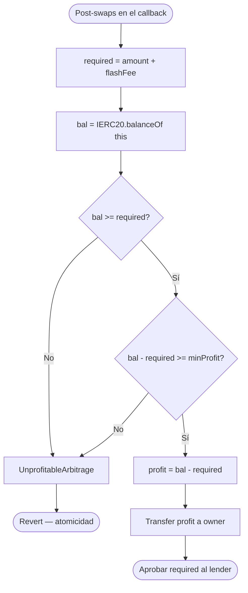
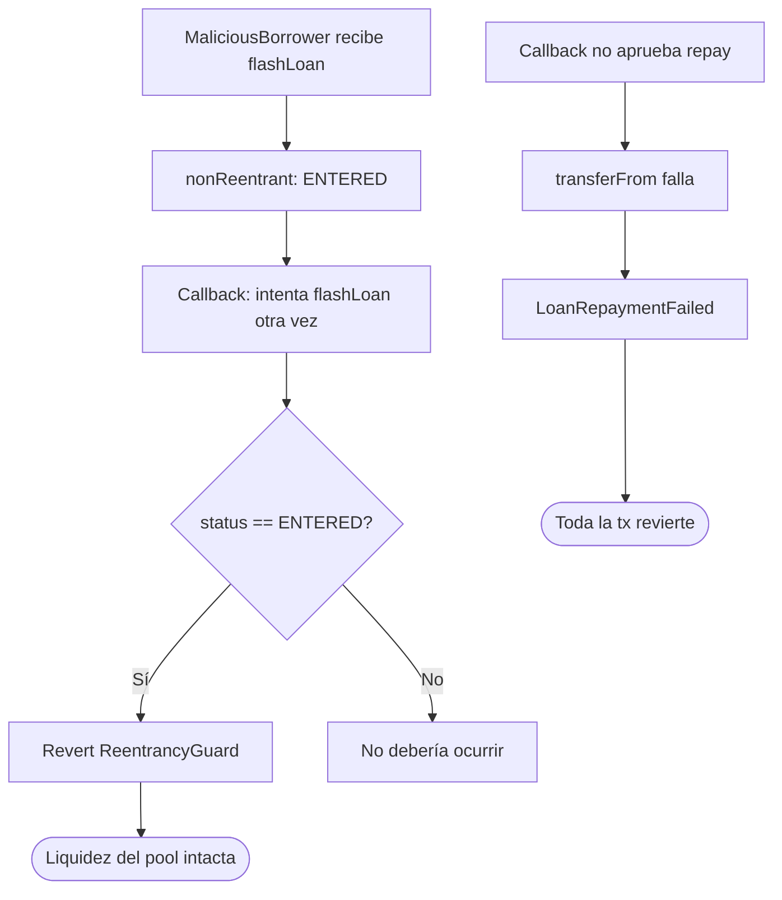
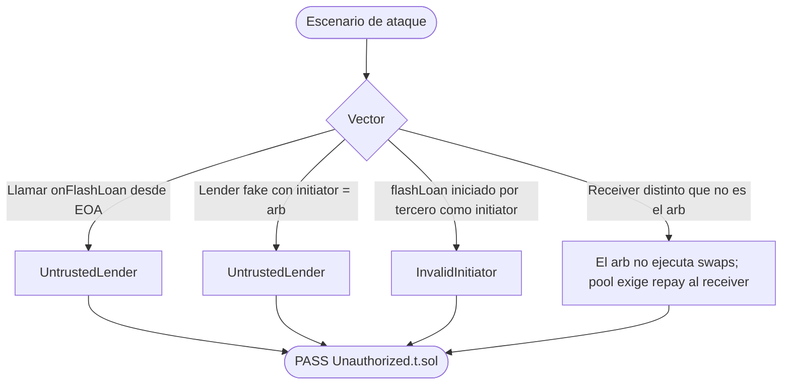
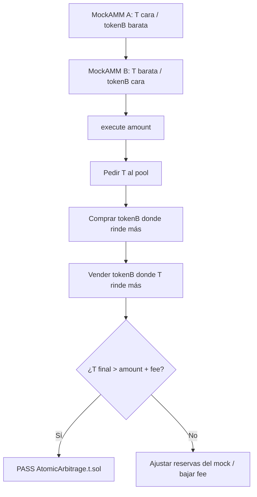

# Flujograma del proyecto — Flash Loans & Atomic Arbitrage

Flujograma operativo **to-be** (v1): setup → liquidez → execute → callback → repay → seguridad → TDD.

## 1. Flujograma maestro del sistema

## 2. Flujograma detallado de rentabilidad

## 3. Flujograma de seguridad (reentrancy + CEI)

## 4. Flujograma unauthorized callback

`initiator` en ERC-3156 es quien llamó `flashLoan`. Si un tercero llama `pool.flashLoan(arb, ...)`, `initiator` sería el tercero y `AtomicArbitrage` revierte `InvalidInitiator`. Solo `execute()` (el propio contrato) es un initiator válido.

## 5. Flujograma del pipeline de desarrollo (TDD)

```mermaid
flowchart LR
    A[.cursorrules] --> B[Docs planificación]
    B --> C[Tests lender rojos]
    C --> D[FlashLoanPool]
    D --> E[Tests arb + mocks AMM rojos]
    E --> F[AtomicArbitrage + auth]
    F --> G[Unprofitable revert]
    G --> H[Unauthorized + reentrancy]
    H --> I[Fuzz + invariant liquidez]
    I --> J[Fork opcional + gas + NatSpec]
    J --> K([Módulo cerrado])
```

## 6. Matriz flujo ↔ función ↔ invariante

| Paso del flujograma | Función | Invariante / postcondición |
|---------------------|---------|----------------------------|
| Deposit liquidez | `FlashLoanPool.deposit` | `balance(pool)` ↑; `maxFlashLoan` ↑ |
| Cap del préstamo | `maxFlashLoan` | `<= IERC20.balanceOf(pool)` |
| Fee | `flashFee` | `amount * feeBps / 10_000` |
| Préstamo | `flashLoan` | Tras éxito: pool ≥ pre + fee |
| Callback auth | `onFlashLoan` | solo lender + initiator = this |
| Round-trip | `_swapRoundTrip` | token prestado vuelve al arb |
| Profit | `_payProfit` | owner ↑; **sin** SSTORE de acumulado |
| No rentable | `onFlashLoan` | revert; balances pre-tx |
| Callback falso | `onFlashLoan` | `UntrustedLender` / `InvalidInitiator` |
| Reentrada | `flashLoan` | segunda llamada revierte |
| Repay | `transferFrom` | `LoanRepaymentFailed` si allowance/balance cortos |

## 7. Flujograma de dos AMMs (imbalance de test)

Las reservas se setean en `setUp()` para que el camino A→B sea **determinísticamente** rentable en el test feliz y **no** rentable en el test de revert.

## 8. Cómo leer estos diagramas

1. **Setup**: pool con liquidez, dos AMMs con precios distintos, arb apuntando al lender.
2. **Execute → flashLoan**: el capital sale del pool solo dentro de una tx que debe cerrar con repay.
3. **Callback**: autenticación primero; swaps después; profit en transfer directo; luego approve.
4. **Cierre**: magic value + `transferFrom`; si algo falla, **todo** revierte (incluido el profit).
5. **TDD**: tests rojos del lender → pool → tests del arb → auth/unprofitable → fuzz → cierre.
